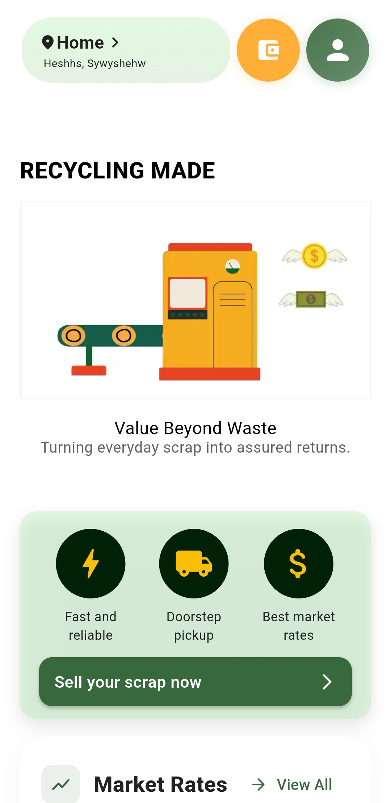
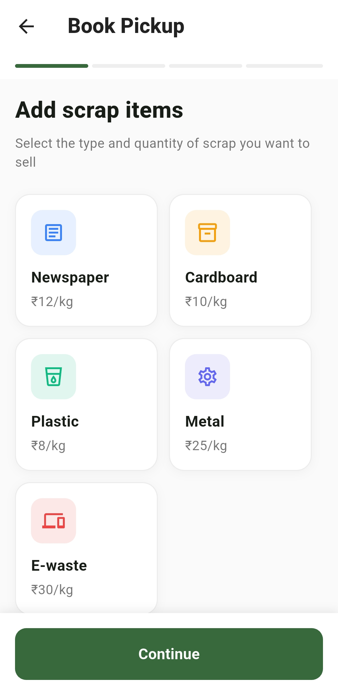
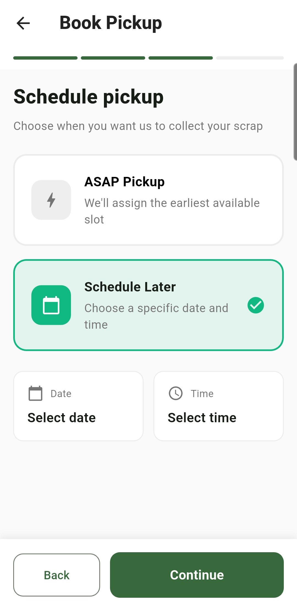
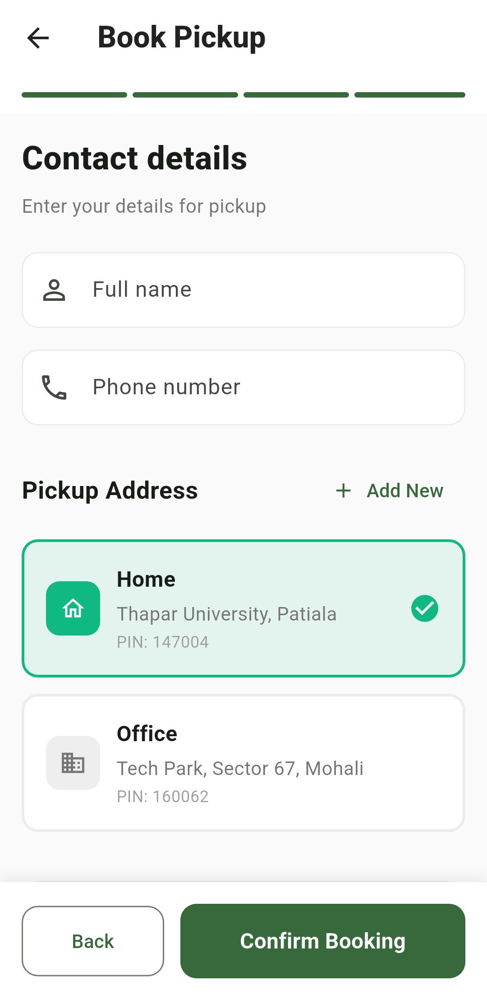
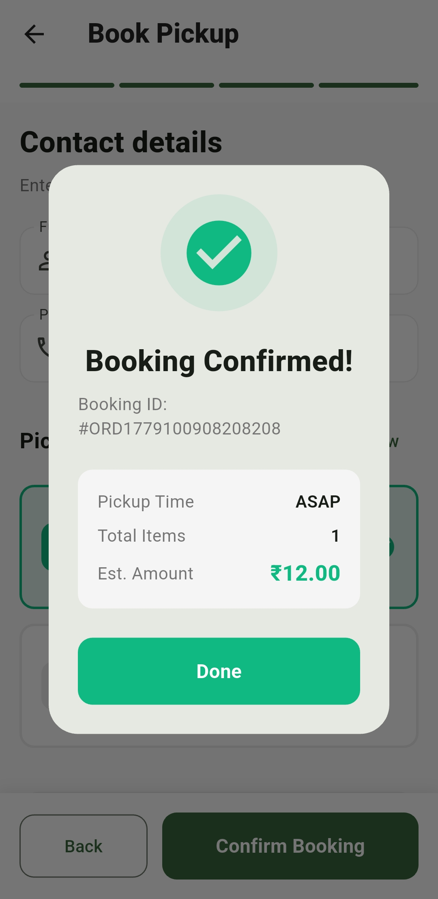
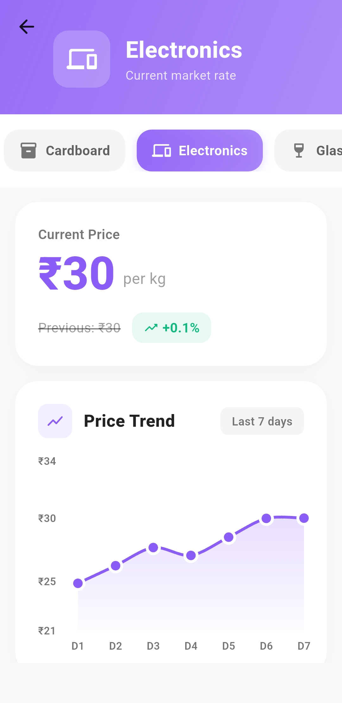

# ♻️ DCrap: Smart Scrap Selling Platform

<div align="center">


**Transforming waste into value with a tap.**

[Features](#-key-features) • [Screenshots](#-screenshots) • [Architecture](#-project-architecture) • [Getting Started](#-getting-started) • [Contributing](#-contributing)

</div>

---

## 📖 Overview

**DCrap** is a modern, eco-conscious platform designed to make selling recyclable scrap as easy as ordering food online. With a seamless cross-platform mobile application and a robust backend, DCrap empowers households to effortlessly schedule scrap pickups, get transparent pricing, and contribute to a sustainable future. 

Whether it's old newspapers, cardboard, plastics, or e-waste, DCrap provides a reliable and transparent way to recycle and earn.

---

## ✨ Key Features

*   **📱 Seamless Multi-Platform Experience:** Beautiful, responsive UI built with Flutter for Android, iOS, and Web.
*   **⚖️ Transparent Pricing:** Real-time rate estimates for various scrap categories (Newspaper, Cardboard, Plastic, Metal, E-waste) based on weight.
*   **🗓️ Smart Scheduling:** 
    *   **ASAP:** Get the quickest available pickup slot.
    *   **Custom:** Choose a specific date and time that suits you.
    *   **Auto-Pickup:** Set up recurring collections (daily, weekly, monthly) for hassle-free recycling.
*   **📸 Visual Verification:** Upload photos of your scrap for more accurate pricing and verification.
*   **📍 Location Services:** Auto-fill capabilities, smart contact management, and robust address handling.
*   **📊 Order Tracking:** Keep track of your scheduled pickups, completed orders, and overall environmental impact.

---

## 📸 Screenshots

<div align="center">

| Home Screen | Add Items | Schedule Pickup |
| :---: | :---: | :---: |
|  |  |  |

| Contact Details | Confirmation | Market Rates |
| :---: | :---: | :---: |
|  |  |  |

<!-- </div>

> **Note for developers:** Place your screenshot images in the `screenshots/` directory matching the filenames above. -->

---

## 🏗 Project Architecture

DCrap is structured as a monorepo containing three primary components:

1.  **`/lib` (Frontend App):** The main Flutter application handling the user interface and interactions. Built with a feature-first architecture and Riverpod for state management.
2.  **`/dcrap_backend` (API Server):** A Node.js & Express RESTful API powering the platform. It handles user data, order processing, dynamic rate management, and interfaces with MongoDB and Firebase Auth.
3.  **`/landing_page`:** A static promotional website built with HTML, CSS, and Vanilla JS.

---

## 🚀 Getting Started

Follow these steps to set up the DCrap project on your local machine.

### Prerequisites
*   [Flutter SDK](https://flutter.dev/docs/get-started/install) (v3.35.3 or higher recommended)
*   [Node.js](https://nodejs.org/) (v18+ recommended)
*   [MongoDB](https://www.mongodb.com/) (Local or Atlas cluster)
*   Firebase Project (for Authentication and Storage)

### 1. Backend Setup (`/dcrap_backend`)

```bash
# Navigate to the backend directory
cd dcrap_backend

# Install dependencies
npm install

# Create a .env file based on .env.example
# Add your MongoDB URI and Firebase Admin credentials
cp .env.example .env

# Start the development server
npm run dev
```

### 2. Frontend Setup (Flutter)

```bash
# Return to the project root
cd ..

# Install Flutter dependencies
flutter pub get

# Ensure you have your Firebase configuration files ready:
# - android/app/google-services.json
# - ios/Runner/GoogleService-Info.plist
# - .env file in the root for Flutter environment variables

# Run the app
flutter run
```

---

## 🛠 Tech Stack

**Frontend:**
*   **Framework:** Flutter & Dart
*   **State Management:** Riverpod (`flutter_riverpod`)
*   **Routing & UI:** Material 3, Lottie, FL Chart
*   **Services:** Firebase Auth, Firebase Storage

**Backend:**
*   **Runtime:** Node.js
*   **Framework:** Express.js
*   **Database:** MongoDB (Mongoose)
*   **Authentication:** Firebase Admin SDK

---

## 📄 License

Distributed under the MIT License. See `LICENSE` for more information.

---
<div align="center">
<i>Built to make recycling accessible for everyone.</i>
</div>